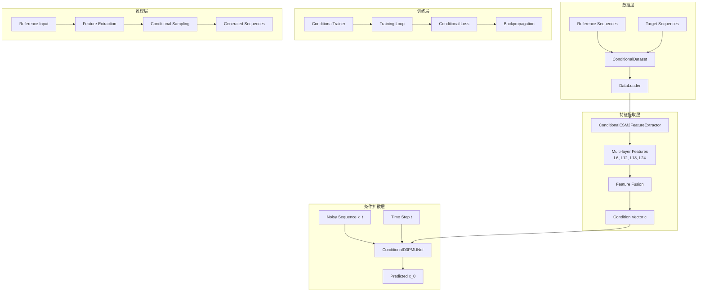

# 条件扩散架构设计文档

## 📋 项目概述

将现有的D3PM离散扩散模型扩展为条件扩散模型，通过深度融合ESM-2蛋白质语言模型特征，实现基于参考序列的抗菌肽条件生成。

## 🎯 核心目标

1. **深度条件融合**：将ESM-2特征深度集成到D3PM扩散过程中
2. **高效特征提取**：设计多层ESM-2特征提取和缓存系统
3. **科研价值最大化**：创建具有发表潜力的条件生成方法
4. **系统完整性**：与现有训练和推理系统无缝集成

## ✅ 已完成工作

### 1. **数学框架设计** ✅
- **条件扩散理论基础**
  ```math
  # 原始D3PM前向过程
  q(x_t | x_{t-1}) = Cat(x_t; α_t x_{t-1} + (1-α_t)/K)
  
  # 条件扩散前向过程（保持不变）
  q(x_t | x_{t-1}, c) = q(x_t | x_{t-1})
  
  # 条件扩散反向过程（核心修改）
  p_θ(x_{t-1} | x_t, c, t) = Cat(x_{t-1}; f_θ(x_t, c, t))
  
  # 训练目标
  L = E_{x_0, c, t, x_t} [-log p_θ(x_0 | x_t, c, t)]
  ```
- **ESM-2条件特征处理策略**
- **Classifier-Free Guidance数学框架**

### 2. **核心架构设计** ✅
- **ConditionalD3PMUNet架构**
  - 深度条件融合机制
  - 每层Transformer都有Cross-Attention
  - 支持Classifier-Free Guidance
- **ConditionalTransformerLayer设计**
  - 自注意力 + 条件交叉注意力
  - 残差连接和层归一化
- **条件化训练损失函数**

### 3. **ESM-2特征提取管道设计** ✅
- **ConditionalESM2FeatureExtractor**
  - 多层特征提取（Layer 6, 12, 18, 24）
  - 智能缓存系统
  - 多种池化策略（Attention/Mean/Max）
- **ConditionalFeatureManager**
  - 预计算特征管理
  - 批量处理优化
  - 性能监控和统计

## 🔄 实现计划

### Phase 1: 核心组件实现 (P0 - 关键路径)

#### 1.1 ESM-2特征提取器实现
- **文件**: `enhanced_architecture/conditional_esm2_extractor.py`
- **功能**:
  - 实现ConditionalESM2FeatureExtractor类
  - 多层特征提取和融合
  - 缓存系统实现
- **预计时间**: 2-3天
- **依赖**: 现有ESM-2实现

#### 1.2 条件扩散模型实现
- **文件**: `gram_predictor/diffusion_models/conditional_d3pm.py`
- **功能**:
  - 实现ConditionalD3PMUNet
  - 实现ConditionalTransformerLayer
  - 条件化训练损失
- **预计时间**: 3-4天
- **依赖**: 现有D3PM实现

#### 1.3 数据配对策略设计
- **文件**: `gram_predictor/data/conditional_dataset.py`
- **功能**:
  - 定义参考序列-目标序列配对规则
  - 实现ConditionalDataset类
  - 数据预处理管道
- **预计时间**: 2天
- **依赖**: 现有数据加载器

### Phase 2: 训练集成 (P1)

#### 2.1 条件训练流程
- **文件**: `enhanced_architecture/conditional_trainer.py`
- **功能**:
  - 修改训练循环支持条件输入
  - 实现条件验证指标
  - 集成特征提取器
- **预计时间**: 3-4天
- **依赖**: Phase 1完成

#### 2.2 推理和生成
- **文件**: `gram_predictor/conditional_generation_service.py`
- **功能**:
  - 条件生成接口
  - Classifier-Free Guidance采样
  - 多种条件采样策略
- **预计时间**: 2-3天
- **依赖**: Phase 1完成

### Phase 3: 系统集成和优化 (P2)

#### 3.1 配置管理更新
- **文件**: `gram_predictor/config/conditional_config.py`
- **功能**:
  - 条件扩散配置参数
  - 超参数管理
  - 实验配置模板
- **预计时间**: 1天

#### 3.2 评估框架
- **文件**: `evaluation/conditional_evaluator.py`
- **功能**:
  - 条件生成质量评估
  - 与参考序列相似度计算
  - 生物学有效性验证
- **预计时间**: 2-3天

#### 3.3 Web服务集成
- **文件**: `gram_predictor/conditional_generation_service.py`
- **功能**:
  - REST API扩展
  - 条件生成端点
  - 批量处理支持
- **预计时间**: 1-2天

## 🏗️ 技术架构图



## 📊 关键技术特性

### 1. **深度条件融合**
- **初始融合**: Cross-Attention机制
- **层级融合**: 每个Transformer层都有条件交叉注意力
- **特征增强**: 多层ESM-2特征的加权组合

### 2. **高效特征管理**
- **多层提取**: 同时使用ESM-2的多个层特征
- **智能缓存**: 基于序列哈希的特征缓存
- **预计算优化**: 常用序列特征预计算

### 3. **灵活采样策略**
- **Classifier-Free Guidance**: 可控的条件强度
- **多样性采样**: 防止模式坍塌
- **温度控制**: 生成随机性调节

### 4. **科研导向设计**
- **消融实验友好**: 模块化设计便于对比实验
- **指标完整**: 多维度评估生成质量
- **可解释性**: 注意力权重可视化

## 🔬 实验设计框架

### 消融实验计划
1. **条件融合方式对比**
   - 简单特征拼接 vs Cross-Attention
   - 单层融合 vs 多层融合
   - 不同ESM-2层的效果

2. **采样策略对比**
   - 标准采样 vs CFG采样
   - 不同guidance scale的影响
   - 温度参数调优

3. **特征提取策略对比**
   - 不同池化方法效果
   - 多层特征组合策略
   - 缓存系统性能分析

### 评估指标
- **生成质量**: BLEU, 编辑距离, 序列多样性
- **条件一致性**: 与参考序列的相似度
- **生物学有效性**: 抗菌活性预测, 理化性质分析
- **计算效率**: 推理速度, 内存使用, 缓存命中率

## 📁 文件结构规划

```
gram_predictor/
├── diffusion_models/
│   ├── d3pm_diffusion.py                 # 现有D3PM实现
│   ├── conditional_d3pm.py               # 新增：条件扩散实现
│   └── conditional_scheduler.py          # 新增：条件调度器
├── data/
│   ├── data_loader.py                    # 现有数据加载器
│   └── conditional_dataset.py            # 新增：条件数据集
├── config/
│   ├── model_config.py                   # 现有配置
│   └── conditional_config.py             # 新增：条件扩散配置
├── web/
│   └── conditional_api.py                # 新增：条件生成API
├── generation_service.py                 # 现有生成服务
└── conditional_generation_service.py     # 新增：条件生成服务

enhanced_architecture/
├── esm2_auxiliary_encoder.py             # 现有ESM-2实现
├── conditional_esm2_extractor.py         # 新增：条件特征提取器
├── conditional_loss.py                   # 新增：条件损失函数
├── main_trainer.py                       # 现有训练器
└── conditional_trainer.py                # 新增：条件训练器

evaluation/
└── conditional_evaluator.py              # 新增：条件评估框架

experiments/
├── conditional_experiment_manager.py     # 新增：实验管理
└── configs/                              # 实验配置文件
    ├── baseline_config.yaml
    ├── ablation_configs/
    └── production_config.yaml

utils/
├── conditional_metrics.py                # 新增：条件生成指标
└── visualization.py                      # 新增：结果可视化
```

## 🚀 下一步行动

### 立即开始 (本周)
1. **实现ConditionalESM2FeatureExtractor** - 特征提取是整个系统的基础
2. **设计数据配对策略** - 定义训练数据的组织方式
3. **实现ConditionalD3PMUNet** - 核心条件扩散模型

### 短期目标 (2周内)
1. **完成基础条件训练** - 让系统能够进行条件训练
2. **实现条件生成** - 基础的条件序列生成功能
3. **初步实验验证** - 验证条件生成的有效性

### 中期目标 (1个月内)
1. **完整评估框架** - 全面的生成质量评估
2. **系统优化** - 性能优化和稳定性提升
3. **实验分析** - 完整的消融实验和结果分析

## 💡 技术风险和缓解策略

### 风险1: ESM-2特征提取效率
- **风险**: 大模型推理速度慢，影响训练效率
- **缓解**: 智能缓存系统 + 预计算策略

### 风险2: 条件融合效果不佳
- **风险**: 简单的特征融合可能效果有限
- **缓解**: 多种融合策略对比 + 消融实验

### 风险3: 训练稳定性
- **风险**: 条件扩散训练可能不稳定
- **缓解**: 渐进式训练 + 仔细的超参数调优

### 风险4: 生成质量评估
- **风险**: 缺乏标准的条件生成评估方法
- **缓解**: 多维度评估指标 + 人工评估结合

## 📈 成功标准

### 技术指标
- [ ] 条件生成成功率 > 95%
- [ ] 与参考序列相似度 > 0.7
- [ ] 生成序列多样性保持在合理范围
- [ ] 推理速度 < 10秒/序列

### 科研价值
- [ ] 相比无条件生成有显著提升
- [ ] 消融实验结果清晰
- [ ] 方法具有通用性和可扩展性
- [ ] 代码质量达到开源标准

---

**文档版本**: v1.0  
**创建时间**: 2025-06-22  
**最后更新**: 2025-06-22  
**负责人**: Kilo Code & User